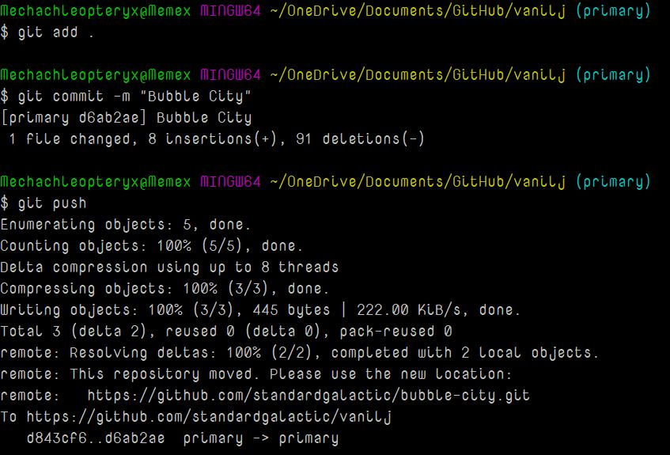
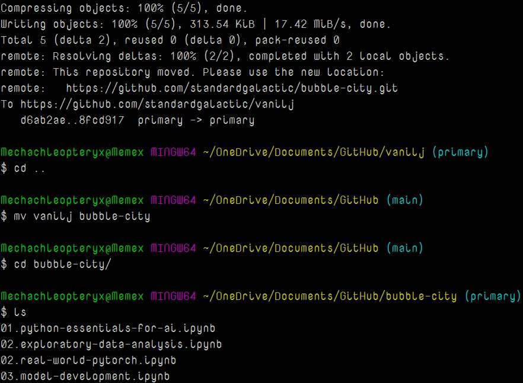
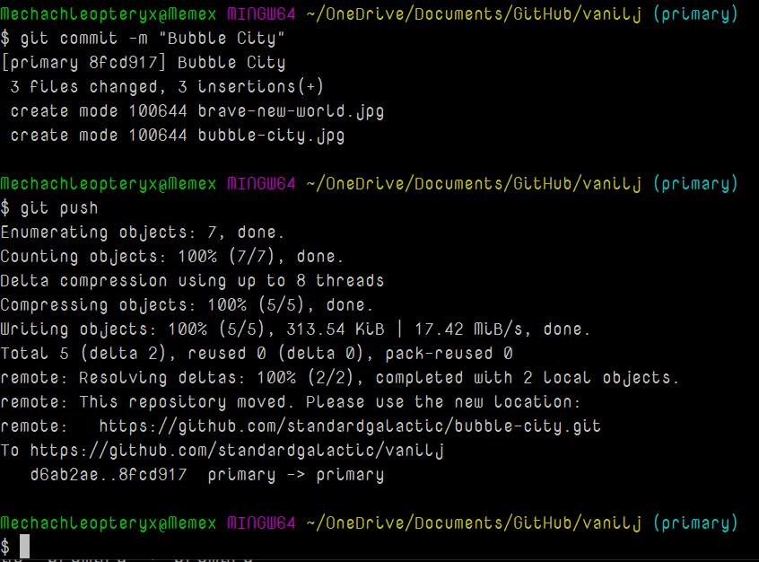

# Bubble City Design Proposal 2.0

*Monica Anderson*

---

## User Experience Example

### Use the Search Feature
- **Step 1:** Enter `[Oblicosm]` in the search box and hit return. A new window (or tab, depending on your preferences) opens.
- **Step 2:** You have created a "Bubble", and it is displayed in a "Bubble Window". In this mode, Bubble City operates similarly to a web search engine like Google or Bing, but it is designed for real-time messages.
- **Step 3:** The result of a search on Bubble City is a topic-specific chat room (one chat room, not a list of results as in web search) where people only discuss the topic you searched for.
- **Step 4:** All bubbles open in a new window (or tab). The window will display messages about the Oblicosm, going back as far in time as your screen height allows, and can be scrolled.
- **Step 5:** You can read these messages to catch up. In low-traffic bubbles, there may not be many messages, and some may be quite old. Messages you have already seen will be displayed in gray. You can scroll back in higher-volume bubbles or mark everything as read.

### Sample User Experience: Swipe Tuning
- **Step 1:** Start by browsing message titles in the Bubble View. Swipe left on irrelevant or possibly spam messages to turn them reddish gray. There may be "collateral rejection" of other messages on the same topic also turning reddish gray.
- **Step 2:** Swipe right on the best messages to highlight them in green. There is a refresh button that redraws the screen, discarding irrelevant messages and accepting green highlights. Similar messages to those you have right-swiped may appear.
- **Step 3:** If you cannot use swipe gestures, use the `- (Minus)` and `+ (Plus)` buttons on each message to deprecate or encourage that message, and any similar messages.
- **Step 4:** Click on any message that looks interesting. Another window/tab opens, displaying the message in the center. Above it, in reverse chronological order, older messages are shown. If there is traffic in the bubble, new messages in the thread appear below the initial message.
- **Step 5:** You can swipe-tune any message at any time. Swipe-tunes become part of your Bubble definition when you close and save the Bubble.
- **Step 6:** When viewing a thread, you can immediately reply to the message you clicked on. This is the most common way to post something. Click on something interesting, see its thread, type a reply, and watch the thread continue after your message.

### Getting Started
- **Step 1:** Create (enter) a Bubble. If there is no traffic in the Bubble, post something and others may reply. They may have entered the same Bubble weeks ago.

---

## ClickBait Headlines Completely Eliminated
- We can totally avoid clickbait headlines. The mechanism for this is reserved for NDA level discussions. This solution also simplifies or solves several other problems in service design and implementation.

## Traffic Logging for Machine Learning
- All posts are public and need to be kept for at least some time in a repository to be displayed to others as required. This system is designed to be real-time, so we may impose limits on history length.
- Users have no expectation of privacy for this content. Messages in our repository will be used as a corpus for training future versions of the system. We will not sell these corpora to outsiders but may share them with corporate collaborators for language research and product enhancement purposes.

## No Voting On Messages
- Unlike SlashDot and Reddit, voting should be unnecessary and is mostly a nerd-favored solution to noise problems.

## No Need for #HashTags
- #HashTags were invented by IRC and Twitter users due to the lack of a decent semantic search capability. We cannot prevent users from using hashtags, but we can decide whether to support tagging by providing a tag canonicalizing service.

## Edit Button
- Editing would change the Bubble definition and cause trouble in many places. This feature will not be included in the first release.

## No Subscription Fees
- This substantially lowers the threshold for joining.

## No Advertising
- This would substantially lower the enjoyment of the system. We aim to monetize the service exclusively by selling postage.

---

## Links
- [Monica's Patents assigned to Google](https://syntience.com/BubbleCity2.pdf)
- [Introduction to AI Epistemology](https://jimruttshow.blubrry.net/the-jim-rutt-show-transcripts/currents-086-monica-anderson-on-bubble-city/)

---

## Bubble City
### Design Proposal
- **A Twitter Alternative**
- **Not a Social Medium**
- **A Real-Time Idea Router**

---

*Monica Anderson*  
*Syntience Inc*  
*October 31, 2022*

---

